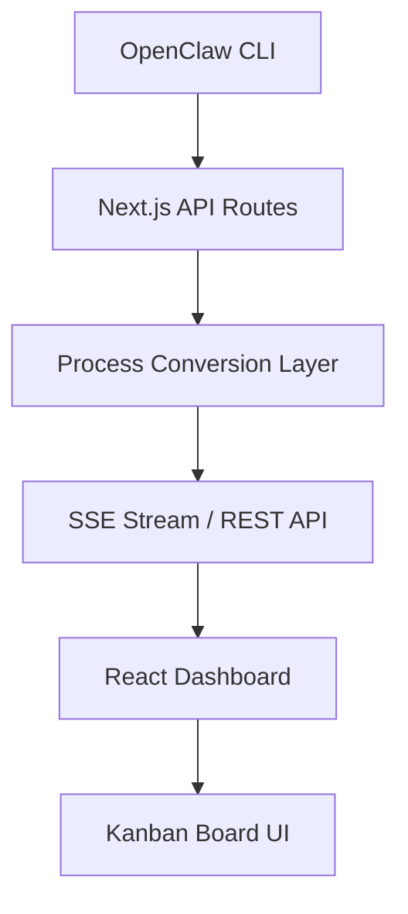

# OpenClaw Dashboard 🤖📊

A beautiful, mobile-first real-time dashboard for monitoring OpenClaw processes with live streaming capabilities.


## ✨ Features

### 📱 **Mobile-First Responsive Design**
- Horizontal scrolling Kanban board optimized for all screen sizes
- Touch-friendly interface with smooth animations
- Adaptive layouts for mobile, tablet, and desktop

### ⚡ **Real-Time Live Streaming**
- **Server-Sent Events (SSE)** for live process monitoring
- **No page refresh needed** - watch processes move between columns in real-time
- **Automatic fallback** to polling mode if streaming fails
- **Visual connection status** indicators

### 🗂️ **5-Column Process Tracking**
- **IDLE** 😴 - Sessions waiting for input
- **RUNNING** ⚡ - Active processes executing
- **WAITING** ⏳ - Processes awaiting responses
- **COMPLETED** ✅ - Finished tasks and jobs
- **ERROR** ❌ - Failed processes needing attention

### 🔌 **OpenClaw Integration**
- **Real-time session monitoring** via `openclaw sessions`
- **Cron job status tracking** via `openclaw cron list`
- **Gateway health monitoring** via `openclaw gateway status`
- **Smart process classification** (main sessions, sub-agents, cron jobs, background tasks)

### 💡 **Rich Process Information**
- Token usage tracking and display
- Execution time and progress indicators
- Tool usage visualization
- Error messages and debugging info
- Session keys and process metadata

## 🚀 Getting Started

### Prerequisites

1. **OpenClaw Gateway** must be running:
   ```bash
   openclaw gateway start
   ```

2. **Node.js 18+** and **npm** installed

### Installation

1. Clone the repository:
   ```bash
   git clone https://github.com/mwinters58/openclaw-dashboard.git
   cd openclaw-dashboard
   ```

2. Install dependencies:
   ```bash
   npm install
   ```

3. Start the development server:
   ```bash
   npm run dev
   ```

4. Open [http://localhost:3000](http://localhost:3000) in your browser

### Production Build

```bash
npm run build
npm start
```

## 🏗️ Architecture

### Real-Time Streaming Options

The dashboard implements multiple update mechanisms:

1. **Server-Sent Events (SSE)** ⚡ **(Default)**
   - Real-time streaming via `/api/openclaw/stream`
   - Updates every 3 seconds
   - Automatic reconnection with exponential backoff
   - Heartbeat monitoring

2. **Polling Mode** 🔄 **(Fallback)**
   - REST API calls every 3 seconds
   - Works when SSE is unavailable
   - Toggle via dashboard UI

### API Endpoints

- `GET /api/openclaw/gateway-status` - Gateway health check
- `GET /api/openclaw/sessions` - Active sessions list
- `GET /api/openclaw/cron-jobs` - Cron job status
- `GET /api/openclaw/processes` - Combined process data
- `GET /api/openclaw/stream` - SSE live stream

### Data Flow



## 🎨 Tech Stack

- **Frontend**: Next.js 16, React 19, TypeScript
- **Styling**: Tailwind CSS
- **Real-Time**: Server-Sent Events (SSE)
- **API**: Next.js API Routes
- **Integration**: OpenClaw CLI commands
- **Build**: Turbopack, ESNext

## 📊 Process Types & Status Logic

### Process Types
- **session** 💬 - Main interactive sessions
- **sub-agent** 🤖 - Spawned sub-agents
- **cron** ⏰ - Scheduled jobs
- **background** 🔄 - Background tasks
- **system** ⚙️ - System processes

### Status Classification Logic
- **IDLE** - Sessions waiting for input (age > 30 min, no recent activity)
- **RUNNING** - Active processes (recent activity < 5 min)
- **WAITING** - Processes awaiting responses (5-30 min since last activity)
- **COMPLETED** - Successful completions with tokens > 0
- **ERROR** - Aborted sessions or processes with consecutive errors

## 🔧 Configuration

### Environment Variables

Create a `.env.local` file:

```env
OPENCLAW_GATEWAY_PORT=18789
OPENCLAW_GATEWAY_HOST=127.0.0.1
```

### Dashboard Customization

Modify `src/lib/types.ts` to add new process types or statuses.

Update column configurations in `src/components/KanbanBoard.tsx`.

## 🚨 Troubleshooting

### "OpenClaw Gateway is not running"
```bash
# Start the gateway
openclaw gateway start

# Check status
openclaw gateway status
```

### SSE Connection Issues
- Toggle to polling mode using the dashboard button
- Check browser developer tools for network errors
- Verify API routes are accessible

### No Process Data
```bash
# Test OpenClaw CLI commands directly
openclaw sessions --json
openclaw cron list --json
```

## 🎯 Roadmap

### Phase 1: ✅ Core Dashboard
- [x] Mobile-first Kanban design
- [x] Real OpenClaw API integration
- [x] Process type classification

### Phase 2: ✅ Live Streaming
- [x] Server-Sent Events implementation
- [x] Real-time process updates
- [x] Connection status monitoring

### Phase 3: 🚧 Advanced Features
- [ ] WebSocket Gateway integration
- [ ] Process filtering and search
- [ ] Historical process analytics
- [ ] Performance metrics dashboard

### Phase 4: 📱 Mobile App
- [ ] Progressive Web App (PWA)
- [ ] Offline capability
- [ ] Push notifications

## 🤝 Contributing

1. Fork the repository
2. Create a feature branch: `git checkout -b feature/amazing-feature`
3. Commit changes: `git commit -m 'Add amazing feature'`
4. Push to branch: `git push origin feature/amazing-feature`
5. Open a Pull Request

## 📄 License

This project is licensed under the MIT License - see the [LICENSE](LICENSE) file for details.

## 🙏 Acknowledgments

- **OpenClaw** - The powerful automation framework
- **Next.js Team** - For the incredible React framework
- **Tailwind CSS** - For beautiful, utility-first styling

---

**Live Dashboard. Real Processes. Zero Refresh.** ⚡

Built with ❤️ for the OpenClaw ecosystem.